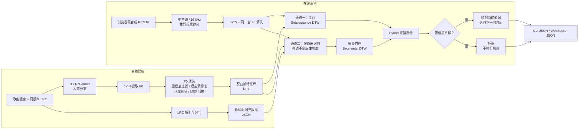

# 单歌手哼歌接唱 MVP

这是一个面向单歌手、有限歌曲库的非流式旋律识别服务。

用户清唱或哼唱 4～8 秒后，系统识别歌曲和当前歌词行，并返回下一句歌词及其开始时间。主识别不依赖 ASR，不使用音频指纹、向量数据库或神经网络旋律检索。

当前示例曲库包含毛不易的《消愁》和《一程山路》。

## 系统架构



## 核心算法

系统使用两条互补的旋律匹配通道。

### 1. 帧级全曲 DTW

查询音频与每首歌的整曲 F0 特征执行 Subsequence DTW：

- 使用相对音高、音高变化、Voiced/Unvoiced 和 onset；
- 允许整体升降调、有限速度变化、少量跑调和短时 F0 缺失；
- 只对有效有声音高对齐计算主要得分；
- 检查配对有声时长、查询覆盖率和路径速度。

帧级通道擅长确定歌曲和原曲时间位置。

### 2. 乐句级旋律轮廓

每个 LRC 候选句独立处理：

- 对查询和候选句分别减去乐句中位音高，消除整体移调；
- 将整句旋律时间归一化；
- 比较音高轮廓、变化方向和音域；
- 当查询包含足够可靠的 F0 时，同时比较完整句以及连续 80%、65% 的局部片段；
- Segmental DTW 使用路径带约束，避免任意时间拉伸。

乐句通道擅长处理不同歌手、不同调性、局部拖音和只唱半句的情况。

### 3. Hybrid 融合与拒识

- 帧级路径覆盖充分时，优先相信其歌曲和时间位置；
- 帧级覆盖不足时，仅允许明显领先第二名的乐句结果接管；
- 两个通道冲突且没有可靠证据时直接拒识；
- 重复或高度相似旋律无法唯一定位时拒识，不根据已知歌词标签作弊。

所有阈值位于 [config.yaml](hum_song_mvp/config/config.yaml)。

## 项目结构

```text
app/
  main.py                   FastAPI、静态页面和 WebSocket 入口
  hum_recognizer.py         PCM16 解码、重采样和结果适配
  web/                      录音与一键干声测试页面

hum_song_mvp/
  config/config.yaml        全部算法与拒识阈值
  src/
    audio_io.py             音频读取和静音裁剪
    vocal_separator.py      离线人声分离
    pitch_extractor.py      pYIN、onset 和标准帧特征
    pitch_postprocess.py    F0 清洗
    dtw_matcher.py          帧级 Subsequence DTW
    phrase_matcher.py       乐句轮廓与 Segmental DTW
    confidence.py           帧级拒识规则
    lyric_mapper.py         DTW 时间到 LRC 行映射
    build_database.py       离线建库 CLI
    recognize.py            Hybrid 识别 CLI
    evaluate.py             通用标注清单评估 CLI
  tests/                    核心单元测试

tools/
  build_mvp_test_queries.py     生成一键干声测试片段
  diagnose_hum_mvp_lines.py     批量回归全部歌词行
  split_silence_cases.py        按静音切分外部清唱
  evaluate_labeled_segments.py  评估连续标注片段
```

音频和生成特征默认不提交到 Git：

```text
data/source_audio/mao_buyi_v1/   原始歌曲混音
data/source_vocals/mao_buyi_v1/  分离后的人声
data/source_lyrics/mao_buyi_v1/  与音频同版本的 LRC
data/queries/                    一键测试和外部测试片段
hum_song_mvp/data/database/      建库后的 JSON / NPZ
```

## 环境要求

- Python 3.10+
- FFmpeg
- 推荐 macOS 或 Linux

安装在线识别依赖：

```bash
python3 -m venv .venv
source .venv/bin/activate
pip install -r requirements.txt
```

只有从歌曲混音自动建库时才需要安装人声分离依赖：

```bash
pip install -r hum_song_mvp/requirements-separation.txt
```

## 离线建库

### 使用已经准备好的干净人声

每首歌必须有同名 LRC，并确保音频与歌词时间戳来自同一个版本：

```text
data/source_vocals/mao_buyi_v1/
  消愁.wav
  一程山路.wav

data/source_lyrics/mao_buyi_v1/
  消愁.lrc
  一程山路.lrc
```

执行：

```bash
cd hum_song_mvp
../.venv/bin/python -m src.build_database \
  --songs-dir ../data/source_vocals/mao_buyi_v1 \
  --lyrics-dir ../data/source_lyrics/mao_buyi_v1 \
  --output-dir data/database \
  --separation-mode none
```

### 从歌曲混音自动分离人声

默认使用 BS-RoFormer：

```bash
cd hum_song_mvp
../.venv/bin/python -m src.build_database \
  --songs-dir ../data/source_audio/mao_buyi_v1 \
  --lyrics-dir ../data/source_lyrics/mao_buyi_v1 \
  --output-dir data/database \
  --separated-vocals-dir ../data/source_vocals/mao_buyi_v1 \
  --separation-mode audio-separator
```

## 启动服务

```bash
.venv/bin/python -m uvicorn app.main:app \
  --host 127.0.0.1 \
  --port 8000
```

浏览器打开：

```text
http://127.0.0.1:8000/demo/
```

页面提供：

- 一键干声测试：随机抽取一条真实人声片段并完整走 WebSocket 识别；
- 用户录音：录制 4～8 秒清唱或哼唱；
- 结果诊断：显示当前句、下一句、拒识原因和各阶段耗时。

## CLI 识别

```bash
cd hum_song_mvp
../.venv/bin/python -m src.recognize \
  --audio ../data/queries/query.wav \
  --database-dir data/database
```

成功结果示例：

```json
{
  "accepted": true,
  "song_id": "消愁",
  "matched_start_time": 40.25,
  "matched_end_time": 43.05,
  "current_lyric_index": 5,
  "current_lyric_text": "固执地唱着苦涩的歌",
  "next_lyric_index": 6,
  "next_lyric_text": "听他在喧嚣里被淹没",
  "next_lyric_start_time": 44.04,
  "score": 0.97
}
```

拒识时 `accepted` 为 `false`，歌曲和歌词位置为 `null`，并返回明确的 `reason`。

## WebSocket 协议

地址：

```text
ws://127.0.0.1:8000/v1/realtime-match
```

消息顺序：

1. 发送开始消息：

```json
{
  "type": "start",
  "matcher_mode": "hum_song_mvp",
  "format": "pcm_s16le",
  "sample_rate": 16000
}
```

2. 发送一个或多个 PCM16 二进制音频块。
3. 发送结束消息：

```json
{"type": "end"}
```

4. 服务一次性执行识别，返回 `type: "result"` 后关闭连接。

当前不是流式逐帧识别；WebSocket 仅用于上传完整乐句和返回结果。

## 测试与评估

运行单元测试：

```bash
cd hum_song_mvp
../.venv/bin/python -m pytest -q
```

生成库内逐句测试片段：

```bash
.venv/bin/python tools/build_mvp_test_queries.py
```

回归全部歌词行：

```bash
.venv/bin/python tools/diagnose_hum_mvp_lines.py
```

将留有静音间隔的外部录音切成独立测试句：

```bash
.venv/bin/python tools/split_silence_cases.py \
  --audio b.MP3 \
  --output-dir data/queries/external_covers/b
```

已知这些片段依次对应《消愁》前十句时：

```bash
.venv/bin/python tools/evaluate_labeled_segments.py \
  --segments-dir data/queries/external_covers/b \
  --song-id 消愁 \
  --first-line-index 0
```

## 当前测试结果

| 数据集 | 正确 | 错接 | 拒识 |
|---|---:|---:|---:|
| 库内逐句干声 | 43 / 45 | 0 | 2 |
| 《消愁》库内逐句 | 25 / 25 | 0 | 0 |
| 外部清唱 b 原始版 | 4 / 10 | 0 | 6 |
| 外部清唱 b 人声分离版 | 8 / 10 | 0 | 2 |

库内 45 句的平均核心识别耗时约为 609 ms。首次请求可能包含 librosa/Numba 初始化开销。

## 已知限制

- 曲库仅适合单歌手和有限歌曲数量；
- 建库音频与 LRC 必须严格同版本；
- 纯旋律无法区分旋律完全相同但歌词不同的段落，此时系统会拒识；
- 输入过短、F0 太少、音高变化不足或候选差距太小时会拒识；
- 当前不支持实时流式识别、ASR 主识别和自动生成接唱人声。
