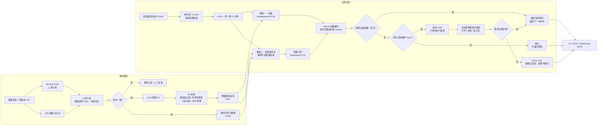

# 单歌手哼歌接唱 MVP

这是一个面向单歌手、有限歌曲库的非流式旋律识别服务。

用户清唱或哼唱 4～8 秒后，系统识别歌曲和当前歌词行，并返回下一句歌词及其开始时间。主识别由旋律完成；只有旋律无法唯一确定歌曲或歌词位置时，才条件调用 ASR 在旋律 Top-K 候选内消歧。系统不使用音频指纹、向量数据库或神经网络旋律检索。

当前运行曲库包含毛不易的 7 首歌：《消愁》《一程山路》《东北民谣》《呓语》《如果有一天我变得很有钱》《爱情神话》和《风吟诛仙》。仓库提交轻量的 F0/歌词匹配数据库，逐句测试干声通过公开 GitHub Release 分发；原始歌曲、整曲分离人声、源 LRC 和用户录音不提交。

## 全新电脑快速启动

仓库已包含运行识别所需的 7 首歌 JSON/NPZ 数据库。macOS 或 Linux 安装 Python 3.10+ 后执行：

```bash
git clone git@github.com:LayNeverGiveUp/sing_follow_mby.git
cd sing_follow_mby
bash scripts/setup_local.sh
bash scripts/run_local.sh
```

`setup_local.sh` 会自动下载约 160 MB 的公开 Release 数据包，校验 SHA-256 后安装 255 个逐句 WAV；因此全新 clone 启动后，麦克风录音和“一键干声测试”都可以直接使用。

打开：

```text
http://127.0.0.1:8000/demo/
```

验证服务和曲库：

```bash
curl http://127.0.0.1:8000/health
```

预期至少包含：

```json
{
  "status": "ok",
  "ready": true,
  "song_count": 7
}
```

这时无需原始歌曲、整曲分离人声或 LRC，CLI、WebSocket、浏览器麦克风识别和一键干声测试都可以使用。

只需要麦克风识别、不想下载逐句 WAV 时可使用轻量安装：

```bash
INSTALL_QUERY_ASSETS=0 bash scripts/setup_local.sh
```

之后随时可以补装：

```bash
.venv/bin/python tools/install_query_assets.py
```

ASR 是旋律模糊消歧的可选增强。需要完整效果时：

```bash
cp .env.example .env
```

将火山引擎 `App ID` 和 `Access Token` 填入 `.env`，再执行 `bash scripts/run_local.sh`。不配置凭据也能启动并识别旋律唯一的输入；需要歌词消歧时会安全拒识。

## 系统架构


```mermaid
flowchart LR
    subgraph Offline["离线建库"]
        A["歌曲混音 + 同版本 LRC"] --> B["BS-RoFormer<br/>人声分离"]
        A --> F["LRC 解析与分句"]
        B --> W["入库门禁<br/>整曲歌声 ASR + 字级时间"]
        F --> W
        W --> X{"版本一致？"}
        X -- "否" --> Y["拒绝入库 / 人工复核"]
        X -- "是" --> C["pYIN 提取 F0"]
        C --> D["F0 清洗<br/>置信度过滤 / 短空洞修复<br/>八度纠错 / MIDI 转换"]
        D --> E["整曲帧特征库<br/>NPZ"]
        X -- "是" --> G["歌词时间元数据<br/>JSON"]
    end

    subgraph Online["在线识别"]
        H["浏览器录音或 PCM16"] --> I["单声道 / 16 kHz<br/>裁剪首尾静音"]
        I --> J["pYIN + 同一套 F0 清洗"]
        J --> K1["通道一：全曲<br/>Subsequence DTW"]
        J --> K2["通道二：候选歌词句<br/>移调不变旋律轮廓"]
        K2 --> K3["质量门控<br/>Segmental DTW"]
        E --> K1
        E --> K2
        G --> K2
        K1 --> L["Hybrid 证据融合<br/>按不同歌曲计算 margin"]
        K3 --> L
        L --> M{"旋律证据能唯一定位？"}
        M -- "是" --> N["映射当前歌词<br/>返回下一句时间"]
        M -- "否" --> Q{"存在可靠旋律 Top-K？"}
        Q -- "否" --> O["拒识<br/>不强行猜测"]
        Q -- "是" --> S["条件 ASR<br/>只转写用户歌词"]
        S --> T["仅在旋律候选中重排<br/>字符 / 拼音 / 差异词"]
        T --> U{"歌词证据足够？"}
        U -- "是" --> N
        U -- "否" --> V["song_only<br/>歌曲已识别，位置不确定"]
    end

    N --> P["CLI JSON / WebSocket JSON"]
    O --> P
    V --> P
```

## 核心算法

系统使用两条互补的旋律匹配通道。

### 1. 帧级全曲 DTW

查询音频与每首歌的整曲 F0 特征执行 Subsequence DTW：

- 使用相对音高、音高变化、Voiced/Unvoiced 和 onset；
- 允许整体升降调、有限速度变化、少量跑调和短时 F0 缺失；
- 只对有效有声音高对齐计算主要得分；
- 检查配对有声时长、查询覆盖率和路径速度。

帧级通道擅长确定歌曲和原曲时间位置。

### 2. 乐句级旋律轮廓

每个 LRC 候选句独立处理：

- 对查询和候选句分别减去乐句中位音高，消除整体移调；
- 将整句旋律时间归一化；
- 比较音高轮廓、变化方向和音域；
- 当查询包含足够可靠的 F0 时，同时比较完整句以及连续 80%、65% 的局部片段；
- Segmental DTW 使用路径带约束，避免任意时间拉伸。

乐句通道擅长处理不同歌手、不同调性、局部拖音和只唱半句的情况。

### 3. Hybrid 融合与拒识

- 乐句 Top1/Top2 差距按不同歌曲计算，同一首歌的多个相似句不会互相压低歌曲置信度；
- 帧级结果只有同时满足有声覆盖率、配对时长和 cost 门槛时才算强证据；低覆盖 DTW 只保留在诊断信息中；
- 强帧 DTW 与乐句通道认定同一首歌时，由两条通道共同确认歌曲，并保留强帧的精确时间和歌词行；
- 乐句结果对其他歌曲明显领先时，可独立完成定位；同歌 N-best 仍用于检查重复旋律位置；
- 歌曲 margin 很小或两个强通道冲突时，ASR 只能重排旋律筛出的 Top-K 歌曲与歌词行，不能在全曲库自由搜索；
- 旋律、歌词或输入质量任一证据不足时拒识，不通过放宽全局阈值强行猜测。

### 4. 条件歌词消歧

歌词通道只在旋律存在多个可靠歌曲或位置候选时运行：

- 全曲 DTW 先固定与旧算法一致的 Top-1，再提取时间分离的 N-best 路径；
- 相邻 DTW 结束帧会在回溯前后两次去重，不会伪装成多个位置；
- 帧级候选还需要乐句轮廓支持，才会触发 ASR；
- 跨歌消歧默认只查看旋律最接近的 4 首歌，每首歌最多保留 3 个歌词位置；
- ASR 文本与每个候选时间窗内的 LRC 做局部字符、无声调拼音和差异字符匹配；
- “啦啦啦”等填充音会被移除，没有有效文字时明确拒绝位置定位；
- 当前句和下一句文本完全等价的重复段落视为同一输出，不额外触发 ASR。

所有阈值位于 [config.yaml](hum_song_mvp/config/config.yaml)。

## 项目结构

```text
app/
  main.py                   FastAPI、静态页面和 WebSocket 入口
  hum_recognizer.py         PCM16 解码、重采样和结果适配
  debug_capture.py          保存原始请求音频和识别诊断
  web/                      录音与一键干声测试页面

hum_song_mvp/
  config/config.yaml        全部算法与拒识阈值
  src/
    audio_io.py             音频读取和静音裁剪
    vocal_separator.py      离线人声分离
    pitch_extractor.py      pYIN、onset 和标准帧特征
    pitch_postprocess.py    F0 清洗
    dtw_matcher.py          帧级 Subsequence DTW
    phrase_matcher.py       乐句轮廓与 Segmental DTW
    lyrics_asr.py           条件 ASR 适配器
    lyrics_reranker.py      中文歌词归一化与候选重排
    alignment_validator.py  LRC/音频版本校验与时间拟合
    confidence.py           帧级拒识规则
    lyric_mapper.py         DTW 时间到 LRC 行映射
    build_database.py       离线建库 CLI
    recognize.py            Hybrid 识别 CLI
    evaluate.py             通用标注清单评估 CLI
  tests/                    核心单元测试

tools/
  bootstrap_runtime.py          创建运行目录并校验内置曲库
  install_query_assets.py       下载并校验 Release 逐句测试素材
  package_query_assets.py       将本地逐句素材打成版本化 Release ZIP
  build_mvp_test_queries.py     生成一键干声测试片段
  diagnose_hum_mvp_lines.py     批量回归全部歌词行
  split_silence_cases.py        按静音切分外部清唱
  evaluate_labeled_segments.py  评估连续标注片段
  validate_song_alignment.py    入库前校验 LRC 与音频版本

scripts/
  setup_local.sh                安装依赖、校验曲库并下载逐句测试素材
  run_local.sh                  读取可选 .env 并启动服务

assets/
  query_assets.json             当前素材版本、下载地址和 SHA-256
```

运行数据库随仓库提交，源素材和测试产物默认不提交：

```text
data/source_audio/mao_buyi_v1/   原始歌曲混音
data/source_vocals/mao_buyi_v1/  分离后的人声
data/source_lyrics/mao_buyi_v1/  与音频同版本的 LRC
data/queries/mao_buyi_v1/       从 GitHub Release 安装的一键测试片段
data/queries/external_covers/   本地外部测试片段，不上传 Release
data/alignment_reports/          LRC 校验报告、试听页和校正结果
data/debug_recordings/           WebSocket 原始录音与逐次识别结果
hum_song_mvp/data/database/      随仓库提交的运行时 JSON / NPZ
```

## 逐句测试素材 Release

当前素材版本为 `assets-mao_buyi_v1-v1`，文件名为 `mao_buyi_v1-queries-v1.zip`，包含 255 个 WAV。安装信息和完整性校验值由 [assets/query_assets.json](assets/query_assets.json) 统一管理。

安装器具有以下保护：

- 下载后同时校验压缩包字节数和 SHA-256；
- 解压前校验文件数量、解压后总大小和每个成员路径；
- 拒绝路径穿越和符号链接；
- 先解压到临时目录，成功后再替换正式目录；
- 已安装相同版本时直接跳过，不重复下载。

如果本机已经有人工作业或其他来源的 `data/queries/mao_buyi_v1/`，安装脚本不会静默覆盖；确认需要替换时执行：

```bash
.venv/bin/python tools/install_query_assets.py --force
```

发布新版本时，先从本机素材生成确定性 ZIP 和 manifest：

```bash
.venv/bin/python tools/package_query_assets.py \
  --catalog-id mao_buyi_v1 \
  --version v2
```

将 `dist/` 中的 ZIP 和 manifest 上传到脚本输出的 Release tag，再把新 manifest 内容更新到 `assets/query_assets.json`。`dist/`、下载缓存和解压后的 WAV 均不会进入 Git。

## 环境要求

- Python 3.10+
- FFmpeg（仅重建曲库或处理 MP3/M4A 等源文件时需要）
- 推荐 macOS 或 Linux

安装在线识别依赖：

```bash
python3 -m venv .venv
source .venv/bin/activate
pip install -r requirements.txt
```

### 可选：配置旋律模糊时的歌词消歧

当前内置火山引擎录音文件识别 2.0 适配器。未配置凭据时，旋律能够唯一定位的输入仍可正常识别；跨歌或同歌重复旋律需要歌词时会安全拒识并返回对应原因。

接口与资源开通方式参考[火山引擎录音文件识别标准版 HTTP 官方文档](https://www.volcengine.com/docs/6561/1354868?lang=zh)。项目将用户录音编码成 WAV 后直接通过 base64 提交，不依赖公网音频 URL。

```bash
export VOLCENGINE_ASR_ACCESS_TOKEN="你的 Access Token"
export VOLCENGINE_ASR_APP_ID="你的 App ID"
export VOLCENGINE_ASR_RESOURCE_ID="volc.seedasr.auc"
```

当前项目使用应用鉴权：`App ID + Access Token`。凭据只能通过环境变量注入，不要写进配置、源码或提交记录。

还可以覆盖接口地址：

```bash
export HUM_LYRICS_ASR_PROVIDER="volcengine_auc"
export VOLCENGINE_ASR_SUBMIT_ENDPOINT="https://openspeech.bytedance.com/api/v3/auc/bigmodel/submit"
export VOLCENGINE_ASR_QUERY_ENDPOINT="https://openspeech.bytedance.com/api/v3/auc/bigmodel/query"
```

`GET /health` 和 WebSocket `ack.asr_mode` 会返回 `volcengine_auc`、`missing_credentials` 或 `disabled`，不会返回凭据内容。

为了复盘手机录音问题，WebSocket 请求默认会把服务实际收到的单声道 PCM16 保存到：

```text
data/debug_recordings/YYYY-MM-DD/<case_id>/
  input.wav
  request.json
  result.json
```

返回结果中的 `debug_case_id` 可直接定位这一组文件。该目录已加入 `.gitignore`；生产环境仍需按隐私要求设置保留周期和访问权限。可通过 `HUM_SONG_DEBUG_RECORDINGS_DIR` 修改保存目录。

只有从歌曲混音自动建库时才需要安装人声分离依赖：

```bash
pip install -r hum_song_mvp/requirements-separation.txt
```

## 入库前校验 LRC 与歌曲版本

新增歌曲不要直接建库。先用整曲歌声 ASR 的字级时间戳与 LRC 做汉字、拼音序列对齐：

```bash
.venv/bin/python tools/validate_song_alignment.py \
  --audio "data/source_audio/mao_buyi_v1/新歌.mp3" \
  --vocal "data/source_vocals/mao_buyi_v1/新歌.wav" \
  --lrc "data/source_lyrics/mao_buyi_v1/新歌.lrc"
```

如果还没有分离人声，可以让工具先分离：

```bash
.venv/bin/python tools/validate_song_alignment.py \
  --audio "data/source_audio/mao_buyi_v1/新歌.mp3" \
  --lrc "data/source_lyrics/mao_buyi_v1/新歌.lrc" \
  --separation-mode audio-separator
```

默认输出到 `data/alignment_reports/新歌/`：

- `alignment_report.json`：覆盖率、全局偏移、线性漂移、逐行误差和时间轴跳变；
- `asr_transcript.json`：可复用的字级 ASR 结果，重复调试时不再调用云服务；
- `review.html` 与 `review_clips/`：全曲均匀锚点和最大误差点的人工试听页；
- `新歌.corrected.lrc`：仅当问题可归结为安全的全局偏移或轻微线性漂移时生成，不覆盖原文件。

判定分为：

- `pass`：允许入库，进程退出码为 0；
- `warning`：可能同版本但必须试听复核，退出码为 1；
- `fail`：歌词覆盖不足、中途跳变或疑似不同剪辑，拒绝入库，退出码为 2。

复用已有 ASR 结果：

```bash
.venv/bin/python tools/validate_song_alignment.py \
  --audio "data/source_audio/mao_buyi_v1/新歌.mp3" \
  --vocal "data/source_vocals/mao_buyi_v1/新歌.wav" \
  --lrc "data/source_lyrics/mao_buyi_v1/新歌.lrc" \
  --transcript-json "data/alignment_reports/新歌/asr_transcript.json"
```

真实验证中，《消愁》字符覆盖率为 98.0%，26/26 行获得时间锚点，中位误差 82ms、P95 误差 386ms，无时间轴跳变，判定为 `pass`。

## 离线建库

### 使用已经准备好的干净人声

每首歌必须有同名 LRC，并确保音频与歌词时间戳来自同一个版本：

```text
data/source_vocals/mao_buyi_v1/
  <song_id>.wav

data/source_lyrics/mao_buyi_v1/
  <song_id>.lrc
```

音频与 LRC 必须同名；目录中的每一对文件都会参与建库。

执行：

```bash
cd hum_song_mvp
../.venv/bin/python -m src.build_database \
  --songs-dir ../data/source_vocals/mao_buyi_v1 \
  --lyrics-dir ../data/source_lyrics/mao_buyi_v1 \
  --output-dir data/database \
  --separation-mode none
```

### 从歌曲混音自动分离人声

默认使用 BS-RoFormer：

```bash
cd hum_song_mvp
../.venv/bin/python -m src.build_database \
  --songs-dir ../data/source_audio/mao_buyi_v1 \
  --lyrics-dir ../data/source_lyrics/mao_buyi_v1 \
  --output-dir data/database \
  --separated-vocals-dir ../data/source_vocals/mao_buyi_v1 \
  --separation-mode audio-separator
```

## 启动服务

仅在本机使用：

```bash
.venv/bin/python -m uvicorn app.main:app \
  --host 127.0.0.1 \
  --port 8000
```

浏览器打开：

```text
http://127.0.0.1:8000/demo/
```

局域网手机测试时监听所有网卡，并用电脑的局域网 IP 访问：

```bash
.venv/bin/python -m uvicorn app.main:app --host 0.0.0.0 --port 8000
```

```text
http://<电脑局域网IP>:8000/demo/
```

iOS 浏览器通常要求 HTTPS 才允许麦克风。临时联调可使用 Cloudflare Tunnel：

```bash
cloudflared tunnel --url http://127.0.0.1:8000
```

使用命令输出的临时 HTTPS 地址打开 `/demo/`。临时地址会变化，不要写入客户端配置或 README。

页面提供：

- 一键干声测试：随机抽取一条真实人声片段并完整走 WebSocket 识别；
- 用户录音：录制 4～8 秒清唱或哼唱；
- 结果诊断：显示当前句、下一句、拒识原因、各阶段耗时和 `debug_case_id`。

## CLI 识别

```bash
cd hum_song_mvp
../.venv/bin/python -m src.recognize \
  --audio ../data/queries/query.wav \
  --database-dir data/database
```

成功结果示例：

```json
{
  "accepted": true,
  "song_id": "消愁",
  "matched_start_time": 40.25,
  "matched_end_time": 43.05,
  "current_lyric_index": 5,
  "current_lyric_text": "固执地唱着苦涩的歌",
  "next_lyric_index": 6,
  "next_lyric_text": "听他在喧嚣里被淹没",
  "next_lyric_start_time": 44.04,
  "score": 0.97
}
```

拒识时 `accepted` 为 `false`，歌曲和歌词位置为 `null`，并返回明确的 `reason`。

歌曲已识别但重复位置无法确定时：

```json
{
  "accepted": false,
  "recognition_status": "song_only",
  "position_resolved": false,
  "song_id": null,
  "best_candidate_song_id": "消愁",
  "reason": "asr_no_lexical_content"
}
```

`accepted: true` 仍然只表示系统能够可靠给出下一句，因此现有前端和调用方保持兼容。

## WebSocket 协议

地址：

```text
ws://127.0.0.1:8000/v1/realtime-match
```

消息顺序：

1. 发送开始消息：

```json
{
  "type": "start",
  "matcher_mode": "hum_song_mvp",
  "format": "pcm_s16le",
  "sample_rate": 16000,
  "input_source": "microphone",
  "catalog_id": "mao_buyi_v1"
}
```

2. 发送一个或多个 PCM16 二进制音频块。
3. 发送结束消息：

```json
{"type": "end"}
```

4. 服务一次性执行识别，返回 `type: "result"` 和本次 `debug_case_id` 后关闭连接。

当前不是流式逐帧识别；WebSocket 仅用于上传完整乐句和返回结果。

## 测试与评估

运行单元测试：

```bash
cd hum_song_mvp
../.venv/bin/python -m pytest -q
```

生成库内逐句测试片段：

```bash
.venv/bin/python tools/build_mvp_test_queries.py
```

回归全部歌词行：

```bash
.venv/bin/python tools/diagnose_hum_mvp_lines.py
```

将留有静音间隔的外部录音切成独立测试句：

```bash
.venv/bin/python tools/split_silence_cases.py \
  --audio b.MP3 \
  --output-dir data/queries/external_covers/b
```

已知这些片段依次对应《消愁》前十句时：

```bash
.venv/bin/python tools/evaluate_labeled_segments.py \
  --segments-dir data/queries/external_covers/b \
  --song-id 消愁 \
  --first-line-index 0
```

## 当前测试结果

以下数据来自 7 首歌曲库和当前 Hybrid + 条件 ASR 实现：

| 数据集 | 正确 | 错接 | 拒识 |
|---|---:|---:|---:|
| 两首原有库内逐句干声 | 42 / 45 | 0 | 3 |
| 《消愁》库内逐句 | 25 / 25 | 0 | 0 |
| 《一程山路》库内逐句 | 17 / 20 | 0 | 3 |
| 外部清唱 b 人声分离版 | 10 / 10 | 0 | 0 |
| 手机现场录音复盘集 | 3 / 3 | 0 | 0 |

手机复盘集覆盖三种关键路线：

- 《消愁》：歌曲旋律证据明确，但同歌多个相似句需要 ASR 定位；
- 《一程山路》：不同歌曲的旋律 margin 很小，ASR 在旋律 Top-K 内纠正歌曲和歌词行；
- 《东北民谣》：旋律证据充分，不调用 ASR 直接返回下一句。

两首库内逐句共 45 条的 3 个拒识分别来自有效音高变化不足、有效有声时长不足和短句歌词证据不足；没有错误接唱。这里保留拒识，不用全局放宽阈值换取表面通过率。

当前开发机上，三条手机录音的 WebSocket `end_to_result` 分别约为：

- 不调用 ASR：约 1.5 秒；
- 调用 ASR：约 3.5～3.8 秒。

ASR 网络状态会影响总耗时；首次请求还可能包含 librosa/Numba 初始化开销。

## 已知限制

- 曲库仅适合单歌手和有限歌曲数量；
- 建库音频与 LRC 必须严格同版本；
- 纯旋律无法区分旋律完全相同但歌词不同的段落，此时返回 `song_only`；
- ASR 只负责重排旋律候选，不作为全曲库主识别，也不会帮助纯“啦啦啦”区分同旋律歌词；
- 输入过短、F0 太少、音高变化不足或候选差距太小时会拒识；
- 当前 7 首曲库只是工程验证规模；继续扩库前必须重新统计歌曲、歌词行和拒识准确率；
- 当前不支持实时流式旋律识别、ASR 主识别和自动生成接唱人声。
